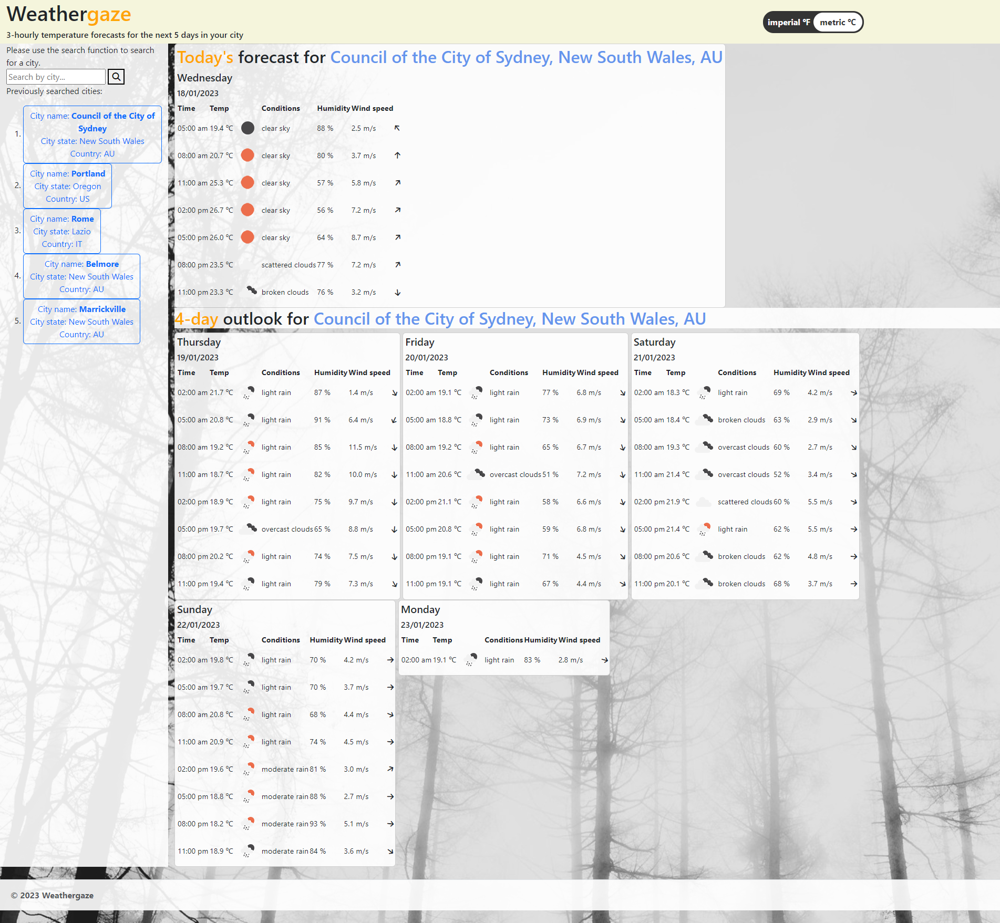
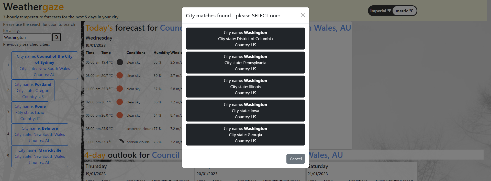

# 06 Server-Side APIs: Weather Dashboard
## "Weathergaze"

### Features:
* Allows user to search for weather forecast by city, using an intermediary modal to allow the user to refine their selection from a list of matches
* Allows user to toggle between metric and imperial units
* Wind direction depicted with a graphical vector
* Search panel includes a panel of the 5 most recent city searches, allowing user to re-run previous searches at the convenience of one click

### Screenshot

